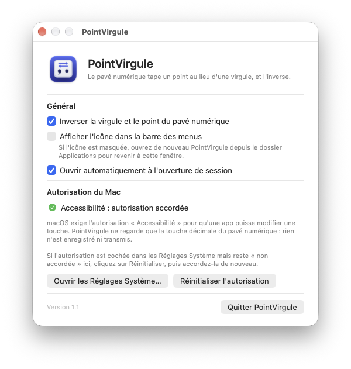

# PointVirgule

Petite app macOS qui inverse la touche décimale du pavé numérique : si elle
tape une virgule, elle tapera un point; si elle tape un point, elle tapera une
virgule. Pour qui travaille avec un clavier canadien-français et veut un point
au pavé numérique, dans toutes les apps.

<p align="center">
  
</p>

## Fonctions

- Inverse la touche décimale du pavé numérique (virgule ⇄ point); les autres
  touches du clavier ne changent pas.
- Verr. Maj n'a aucun effet sur cette touche.
- Sur les claviers où Majuscule change le caractère de la touche
  (Canadien – CSA, français…), Majuscule + la touche tape l'autre caractère.
- L'inversion se met en pause et se réactive depuis le menu.
- L'app vit dans la barre des menus, sans icône dans le Dock; son icône peut
  être masquée.
- Elle peut s'ouvrir automatiquement à l'ouverture de session.
- La fenêtre de réglages montre l'état de l'autorisation Accessibilité et
  permet de la redemander ou de la réinitialiser.

## Installer

Téléchargez [PointVirgule.dmg](https://github.com/mdany75/PointVirgule/releases/latest/download/PointVirgule.dmg)
(toujours la dernière version), puis :

1. Ouvrez l'image disque et glissez PointVirgule dans le dossier Applications,
   puis ouvrez-la. L'app est signée avec un certificat Apple Developer ID et
   notarisée par Apple : macOS l'ouvre sans avertissement.
2. Accordez l'autorisation « Accessibilité » demandée par l'app. macOS l'exige
   pour qu'une app puisse modifier une touche.

Requiert macOS 13 (Ventura) ou plus récent, sur Mac Apple Silicon ou Intel.

Le détail de chaque étape, le dépannage et la désinstallation sont dans
[Lisez-moi.txt](Resources/Lisez-moi.txt), aussi inclus dans l'image disque.

L'autorisation est conservée d'une version à l'autre. Si PointVirgule indique
quand même « non accordée » après une mise à jour, cliquez sur « Réinitialiser
l'autorisation » dans sa fenêtre, puis accordez-la de nouveau.

## Reconstruire

Seuls les outils de ligne de commande d'Apple sont requis
(`xcode-select --install`); Xcode n'est pas nécessaire.

```bash
./build.sh
```

lance les tests, compile l'app (Apple Silicon et Intel), la signe et produit
`build/PointVirgule.dmg`. Avec le certificat « Developer ID Application » dans le
trousseau et le profil `notarisation` de `notarytool`, l'app est signée avec le
runtime durci et l'image disque est notarisée chez Apple (quelques minutes) puis
agrafée ; sans certificat, la signature est ad hoc et le script le dit.
`SKIP_NOTARIZE=1 ./build.sh` saute la notarisation pour un essai rapide.

```bash
./build.sh --install
```

fait la même chose, puis installe l'app dans `/Applications` et l'ouvre.

## Tests

```bash
mkdir -p build && swiftc -swift-version 5 Sources/KeyRemapper.swift Sources/KeyboardLayout.swift Tests/main.swift -o build/tests && build/tests
```

vérifie la conversion sur toutes les dispositions de clavier installées sur le
Mac (plus de 20 000 vérifications). Les tests ne posent aucun événement
clavier et n'installent aucun intercepteur : ils ne touchent ni au clavier, ni
à l'app installée, ni aux réglages du Mac. `./build.sh` les lance aussi.

## Organisation

- `Sources/` : le code de l'app (Swift, AppKit).
  - `KeyRemapper.swift` : interception et conversion de la touche.
  - `KeyboardLayout.swift` : lecture de la disposition de clavier active.
- `Tests/` : vérification de la conversion sur toutes les dispositions
  installées.
- `Resources/` : `Info.plist` et le Lisez-moi inclus dans l'image disque.
- `scripts/make_icon.swift` : dessine l'icône de l'app.
- `docs/` : capture d'écran.
- `build/` : fichiers produits, ignoré par git.
